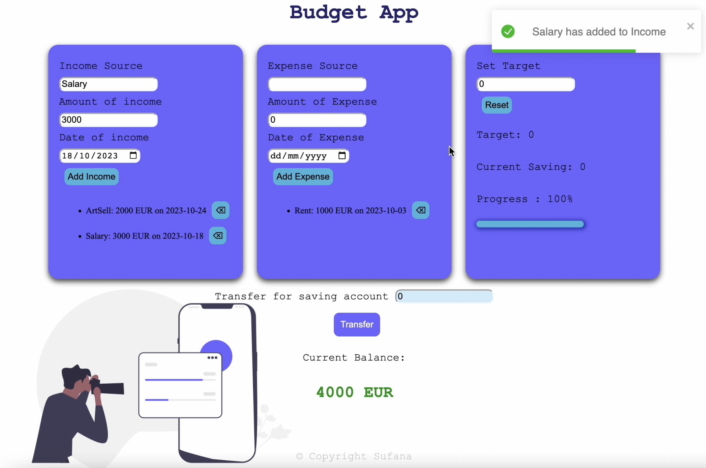

## DEMO:


# My Budget Management App

Hey there! 👋 Welcome to my Budget App Management repository. I'm excited to share this React application I've built to help manage incomes, expenses, and saving targets. It's a TypeScript-powered project that focuses on core concepts while providing a practical solution for personal finance tracking.

## What's Inside?

### Features Overview

- **User-Friendly UI**: I've crafted a clean and intuitive one-page application for effortlessly storing incomes, expenses, and saving targets, along with the saving amount.
  
- **Income & Expense Management**: Implemented features to add income sources, their values, and dates. The same goes for expense sources, values, and dates.

- **Saving Goals**: Users can set their saving targets and update the value of their saving amount.

### Enhanced Functionality

I didn't stop there! The app goes a step further with these advanced features:

- **Account Balance Calculation**: A nifty feature that calculates the account balance using the formula: income - expense - saving = balance.

- **Smart Transfer**: Implemented a feature allowing users to transfer the balance amount directly to their saving amount.

- **Saving Progress Tracker**: Users can check the total of their current savings and the percentage of the current saving amount relative to their saving target.

- **Item Deletion**: Added delete buttons for both income and expense sources, making it easy to manage your financial records.

### Validation with React Hook Form and Zod

To ensure data integrity, I've implemented input validation using React Hook Form and Zod. It's designed to validate input fields for income, expense, target income, and saving account, ensuring they are positive numbers. If you try to sneak in a negative number, I've got a friendly error message waiting for you!

## Getting Started

Excited to give it a try? Here's how you can run My Budget Buddy locally:

### Clone and Install

```bash
git clone 
cd react-budget-app
npm install
